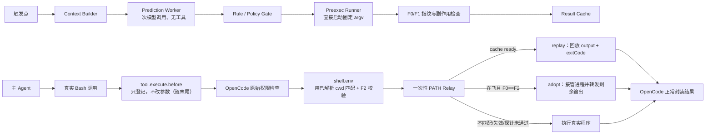

# CodeArts 外置插件安全命令预测预执行详细设计（v1.3.1 定稿）

> 适用基线：OpenCode v1.3.17（commit `517e6c9aa4`），所有内核行为结论见第 2.2 节「已核对事实」  
> 实现边界：仅通过 `@opencode-ai/plugin` 外置插件和公开 SDK，不修改 OpenCode/agent-kernel  
> 更新时间：2026-09-12  
> 参考材料：`AGENTS-codearts.md`、`safe-command-preexec-audit.md`

## 0. 定稿结论

### 0.1 收益模型

预执行能省下的时间不等于命令耗时，只等于「触发点」到「主 Agent 真实发起该命令」之间的重叠窗口（下称 `head_start`，定义为触发点到真实调用进入 `shell.env` 的时间差）：

```text
saved = min(head_start - prediction_latency, command_duration)
```

以用户消息到达为触发点时，`head_start` 通常只有 0.5–3 s，其中还要花 0.3–1.5 s 做预测模型调用；而首批候选命令（typecheck 家族）耗时在 10–300 s 量级。两个直接推论：

1. **必须支持接管在飞进程（adopt）**。若要求缓存先 `ready` 才能复用，则对耗时超过窗口的命令，真实调用到达时预执行必然还在跑，节省恒为 0。改为：真实调用到达时若预执行在飞且指纹有效，Relay 附着该进程、转发剩余输出、透传退出码，节省 = 完整 `head_start`。
2. **必须扩大触发窗口**。只在用户消息到达时预测是窗口最窄的时刻；增加「写工具完成后」触发点（见 4.1），把窗口从「一次推理」扩大到「剩余编辑 + 一次推理」，这也是「改完代码跑 lint/typecheck」这一模式的信号出现位置。

因此验收指标用**绝对节省**而非相对比例（见 14.2）。

### 0.2 主链路

```text
触发点命中（用户消息到达 / 写工具完成）
  -> 轻量模型从已审核规则中预测一个 rule_id
  -> 插件立即在后台预执行该规则的安全命令
  -> 缓存输出、退出码和环境指纹（或保持在飞可接管状态）
  -> 主 Agent 后续真的调用完全相同的 Bash 命令
  -> 原命令照常通过 OpenCode 的解析与权限检查
  -> shell.env 注入一次性 PATH Relay
  -> Relay 回放缓存或接管在飞进程
```

预测子会话只是 **Prediction Worker**：一次无工具模型调用，返回 `rule_id + confidence` 后结束。它不执行命令、不继续 Agent 推理链、不生成可注入主会话的工具结果；命令执行、缓存和复用全部由插件中的确定性代码完成。

### 0.3 交付切分：Phase A 预热 / Phase B 透明复用

首批候选命令自带内容寻址缓存（`.turbo/`、`*.tsbuildinfo`）。只要后台先跑过一遍，主 Agent 后来真跑那次本身就是 cache hit，无需 Relay 即可拿到大部分收益。

| 阶段 | 机制 | 复用方式 | 新增风险面 | 适用命令 |
|---|---|---|---|---|
| **Phase A 预热** | 预测 + 后台预执行 | 不做 Relay，主 Agent 照常真实执行，靠命令自身缓存加速 | 仅「后台跑了一条只读命令」 | 自带缓存的命令 |
| **Phase B 透明复用** | 追加 `shell.env` PATH Relay | 回放缓存或接管在飞进程 | Relay、一次性 token、F2、平台合同 | 不自带缓存的命令 |

两阶段共用预测、规则、指纹、失效、遥测；Phase B 只额外增加 `relay/` 与 `shell-env-reuse`。Phase A 先单独上线取得 `head_start_ms` 真实分布，再据此判断 Phase B 是否值得做（实测 p50 < 1 s 则放弃）。

## 1. 目标与范围

### 1.1 目标

1. 将可预测的安全命令执行时间与主模型推理时间重叠，并在输入环境未变化时复用其结果。
2. 保持模型原始工具参数、OpenCode 权限判断、工具记录和下游 Hook 可观察语义不变。
3. 把误预测的影响限制为可计量的 CPU、内存、token 和插件私有临时空间消耗。
4. 度量命中率、有效复用率、浪费成本、`head_start` 与真实 E2E 收益。

### 1.2 首版范围

- 触发点两个（见 4.1）；每个父会话同一时刻最多一条在飞预测和一条在飞预执行。
- 模型只能选择本地规则目录已有的 `rule_id`，不能生成任意命令。
- 仅覆盖完整调用已审计为安全、幂等、写入限于规则显式声明的缓存路径的命令。
- 仅匹配简单、单进程、精确命令；不做 shell 语义归一化。
- 结果缓存仅存于插件内存或插件私有临时目录，短 TTL、一次性消费。
- 支持成功和非零退出结果复用；超时、被取消、输出超限的结果不缓存。
- Phase A 对所有通过安全审计的平台启用；Phase B 只对通过 Relay 合同测试**且通过运行时自探针**的环境启用。

### 1.3 非目标

- 不让预测子 Agent 提前完成主 Agent 的推理和工具链，不注入子会话消息到主会话。
- 不设计 N-gram、在线学习或自动扩展命令白名单。
- 不缓存 read/glob/grep 等其他工具结果。
- 不把语义相近但字符串不同的命令视为同一个命令。
- 不绕过用户对主 Agent 实际 Bash 调用的权限确认。

### 1.4 依赖安装不在首版（需求偏差，需评审认领）

原需求把「项目初始化后的依赖安装」列为头号高频场景，本设计明确不预执行依赖安装（`bun/npm/pnpm install`）：其 `node_modules/`、lockfile、包管理器全局缓存和 `postinstall` 脚本全部是预期写入与任意代码执行，与「误预测不产生副作用」直接冲突，而外置插件无公开强沙箱可用（见审计文档 D 节）。

两条未来替代路径：① 只预热包管理器全局缓存（需网络、写 HOME，需独立安全准入）；② 隔离 staging 目录 + 产物提升（需新增 sandbox/sidecar 能力）。二者均不在首版。

首版只交付只读检查类命令，「依赖安装秒出」这一客户价值点不成立，需求文档应同步收敛表述。

## 2. v1.3.17 外置插件能力结论

### 2.1 使用的公开能力

| 能力 | 用途 |
|---|---|
| `chat.message` | 获取本轮输入并异步启动预测，不阻塞主 Agent |
| v1 SDK `client.session.create/prompt/abort/delete` | 建立一次性 Prediction Worker |
| `tool.execute.before` | 观察模型真实 Bash 参数并登记 `callID`，不修改参数 |
| `shell.env` | 权限判断之后按 `callID` 注入一次性 Relay 环境；其 `input.cwd` 是内核已解析的绝对路径 |
| `tool.execute.after` | 读取 Relay receipt、比对 `input.args` 是否被改写、打点，不修改 output |
| `event` | 失效信号（`file.edited`、`session.idle`、`session.deleted`）与实例释放（`server.instance.disposed`） |
| `config` | 加载开关、模型、规则和资源预算，注册隐藏 predictor agent |

### 2.2 已核对事实（源码证据）

每一条都对应一个实现假设；任何一条在目标 fork 上不成立，对应能力即关闭。

| # | 事实 | 证据 |
|---|---|---|
| F-1 | Bash 执行顺序为 `tool.execute.before` → `parse/collect` → `ask()` 权限判断 → `shellEnv()` → 启动 shell → `tool.execute.after`。**权限先于 `shell.env`** | `tool/bash.ts:470-494` |
| F-2 | `shell.env` 返回值与 `process.env` 合并且**插件值覆盖 `process.env`**，因此可以改写 `PATH` | `tool/bash.ts:290-296` |
| F-3 | 命令通过 `ChildProcess.make(command, [], { shell, cwd, env })` 执行，shell 取 `process.env.SHELL`（macOS 默认 `/bin/zsh`），**非 login shell**；Windows PowerShell 走 `-NoProfile` 分支 | `tool/bash.ts:298-314`、`shell/shell.ts:82-109` |
| F-4 | `tool.execute.before` 的 `{args}` 是对象引用，链上任一 handler 改 `args.command` 都影响真实执行；`tool.execute.after` 的 `input` 带 `args`，可回溯比对 | `session/prompt.ts:445-469`、`plugin/src/index.ts:226-241` |
| F-5 | `chat.message` 在 `createUserMessage` 内触发，`plugin.trigger` **会 await 所有 handler** 后才进入 `loop()`。预测必须 fire-and-forget | `session/prompt.ts:1263-1273` |
| F-6 | `session.create` body 只有 `{parentID?, title?}`；`session.prompt` body 支持 `{messageID?, model?, agent?, noReply?, system?, tools?, parts}` | `sdk/js/src/gen/types.gen.ts:2079-2088, 2585-2610` |
| F-7 | `tools: {"*": false}` 能屏蔽工具，但机制**不是按工具名过滤**：`session.prompt` 把它转成 session 级 permission ruleset `{permission:"*", pattern:"*", action:"deny"}`；`Permission.disabled()` 用 `Wildcard.match` 匹配 permission 键命中全部工具；`llm.ts resolveTools` 再把它们从 `tools`/`activeTools` 删除。`input.user.tools?.[k] !== false` 是**精确键**匹配，`"*"` 在那条路径上不生效 | `session/prompt.ts:1312-1319`、`permission/index.ts:298-308`、`session/llm.ts:339-345` |
| F-8 | Agent 配置的 `tools` 已 `@deprecated`（转 permission）；`maxSteps` 亦已 `@deprecated`，应使用 `steps` | `config/config.ts:531, 553, 583-597` |
| F-9 | 因 F-7，wildcard deny 作用于 `resolveTools` 产出的完整 `tools` 记录，其中**同时包含内置工具与 MCP 工具** | `session/prompt.ts:436-500`、`session/llm.ts:339-345` |
| F-10 | **插件 `Hooks` 接口没有 `dispose`/`shutdown` 钩子** | `plugin/src/index.ts:189-276` |
| F-11 | 可用于失效判定的内核事件：`file.edited`、`file.watcher.updated`、`session.idle`、`session.deleted`、`message.part.updated`、`server.instance.disposed` | `sdk/js/src/gen/types.gen.ts` 事件联合 |
| F-12 | Bash 的 `workdir` 由内核经 `resolvePath(params.workdir, Instance.directory, shell)` 解析，未传时为 `Instance.directory` | `tool/bash.ts:471` |

F-1 与 F-2 共同构成 Relay 方案的可行性基础：插件可以在不改变 `params.command`、且权限已放行之后，为某一次真实调用注入 PATH Relay。

F-7 的实现约束：合同测试的断言对象必须是「LLM 请求体里 `tools`/`activeTools` 为空」，而不是「工具调用被拒绝」——后者意味着模型看得到工具、会尝试调用、被拒、再重试，白烧 token。断言必须覆盖内置、插件自定义和 MCP 三类工具；若任一类仍出现在请求体中，退化为枚举当次工具注册表逐项置 false。在此被证明前不允许启动预测。

### 2.3 明确否决的复用方式

不得在 `tool.execute.before` 把命令改成 `true`/`echo` 等空操作再于 after 覆盖结果：这会让权限校验、blocked-bash 和遥测看到空操作而非原命令。本设计规定 before 不修改 `input.args`、after 不修改 `output`，原命令仍由 OpenCode 做权限校验，昂贵程序是否真正执行由权限之后的 Relay 决定。

## 3. 总体架构



Phase A 下链路到 `K` 即结束，不接 Relay；主 Agent 的真实调用照常执行。

### 3.1 组件职责

| 组件 | 职责 |
|---|---|
| `TriggerScheduler` | 汇聚 T1/T2 触发点，做去抖、并发与预算控制，fire-and-forget 启动任务 |
| `ContextBuilder` | 构建脱敏、限长的预测上下文和项目类型特征 |
| `PredictionWorker` | 从候选规则中选择一个 `rule_id` 或 abstain |
| `RuleRegistry` | 加载静态规则，完成 schema、平台和审计状态校验 |
| `PolicyGate` | 校验开关、预授权、置信度、资源预算和并发限制 |
| `PreexecRunner` | 不经 shell，用已解析绝对程序路径和固定 argv 运行命令 |
| `FingerprintService` | 生成 F0/F1/F2 输入与环境指纹 |
| `ResultCache` | 保存短期、一次性、可验证的执行结果 |
| `CallRegistry` | 用 `sessionID + callID` 关联真实 Bash 调用与预测结果 |
| `ShellEnvReuse` | 在 `shell.env` 中用已解析的 `input.cwd` 做权威匹配，决定 replay、adopt 或透传 |
| `RelayProbe` | 验证 relay 目录确实赢得 PATH 解析，失败则本环境只跑 Phase A |
| `CommandRelay` | 校验 token/cwd/argv/deadline，回放缓存、接管在飞进程，或 fail-open |
| `Telemetry` | 打点预测、执行、复用、误预测、资源浪费和 E2E 数据 |

## 4. 端到端流程

### 4.1 触发点

| 触发点 | 信号 | 典型 `head_start` | 适用模式 |
|---|---|---|---|
| T1 用户消息到达 | `chat.message` | 0.5–3 s | 「帮我跑一下类型检查」这类显式意图 |
| T2 写工具完成 | `tool.execute.after` 命中 write/edit/apply_patch，或 `event: file.edited`；500 ms 去抖，同一轮只触发一次 | 数秒至数十秒 | 「改完代码跑 lint/typecheck」 |

T2 是收益主来源，也是误预测主来源：后续若继续写文件，F1/F2 必然失配。去抖窗口按第 13 节的命中率与浪费成本指标调优。T2 的预执行必须在写完成之后才计算 F0，且任何后续写事件立即取消在飞预执行（见 8.4）。

### 4.2 预测与预执行

1. 触发点命中（T1 或 T2）。
2. 插件排除 Prediction Worker 自身会话、禁用会话、敏感场景和已在飞任务。
3. Hook 只把任务登记到后台调度器后立即返回（F-5）。
4. `ContextBuilder` 组合：本轮用户文本；最近有限轮对话摘要；项目类型、包管理器、工作目录；当前候选规则的 ID、用途和触发特征；最近已执行工具的类别（不含输出正文）。
5. Prediction Worker 进行一次短模型调用，严格返回 JSON。
6. 若返回 abstain、未知规则、低置信度或超时，本次结束。
7. `PolicyGate` 根据本地规则决定是否允许执行；模型结果不构成授权。
8. `FingerprintService` 计算执行前指纹 F0。
9. `PreexecRunner` 用规则中固定的 `realExecutable + argv + cwd + env` 启动命令。
10. 执行完成后计算 F1；只有 F0 与 F1 的受保护状态一致、无越界写入且结果合规时才写入缓存。

### 4.3 主 Agent 真实调用与复用

1. 主 Agent 输出真实 Bash 工具调用。
2. `tool.execute.before` 登记 `callID → {command, workdir, timeout}`。本插件的 before handler **必须注册在 before 链末尾**，否则看到的可能不是最终会被执行的命令（F-4；既有链上就有会 throw 的 `blocked-bash-cmd`）。
3. **命令匹配的权威时点在 `shell.env`，不在 before**：`shell.env` 的 `input.cwd` 是内核已解析的绝对路径（F-12），而 before 拿到的 `workdir` 可能是相对路径或缺省，在 before 里做精确匹配会产生大量假不命中。before 只登记，`shell.env` 用「登记的 command + input.cwd」生成 `actualKey`。
4. `actualKey` 的最小规范化：统一 CRLF；去掉命令首尾空白；cwd 取 `input.cwd` 的 realpath；不合并内部空白，不重排参数。
5. OpenCode 用原始命令完成解析、黑名单/目录权限检查和用户确认（F-1）。
6. 权限通过后进入 `shell.env`，`ShellEnvReuse` 按预执行状态决策：
   - `ready`：计算 F2，走 replay；
   - `running` 且 `F0 == F2`：走 adopt，注入 Relay 并让其附着在飞进程；
   - `running` 但 `F0 != F2`：取消在飞预执行并透传；
   - 其他：透传。
7. F2、TTL、命令、cwd、toolchain、关键环境和 epoch 全部有效时注入：临时 Relay 目录到 PATH 最前、一次性随机 token、receipt 路径、原始 PATH 和真实程序绝对路径。
8. 原始 shell 仍执行模型给出的原命令，但首个程序解析到 Relay。
9. Relay 校验 token、argv、cwd、deadline 和一次性 claim：
   - replay：回放缓存的合并输出并返回相同退出码；
   - adopt：先输出已产出字节，再流式转发剩余输出，最后透传退出码；
   - 任一校验失败：恢复原始环境，直接 exec 真实程序。
10. OpenCode 按原有逻辑采集输出、生成标题/metadata、做截断并触发 after Hook。
11. `tool.execute.after` 检查 receipt 并打点，并比对 `input.args.command` 与 before 登记值；不一致则记 `args_mutated` 并在本会话降级。不覆盖返回结果。

## 5. Prediction Worker 设计

### 5.1 子会话而不是完整 fork

`session.create` 不支持在创建请求中传 permission（F-6），因此：

1. 在 `config` Hook 中注册隐藏的 `codearts-preexec-predictor` Agent，用 `steps: 1`（不是已废弃的 `maxSteps`，F-8）与 `permission: { "*": "deny" }`；
2. `client.session.create({ body: { parentID, title } })`；
3. `client.session.prompt({ path: { id }, body: { agent: "codearts-preexec-predictor", model, system, tools: { "*": false }, parts } })`；
4. Agent 配置与本次 prompt 两处都 deny，避免配置合并或调用遗漏导致工具暴露（两处最终汇聚到同一条 permission 路径，F-7）；
5. 解析 assistant 文本中的单个 JSON 对象；
6. 完成、超时或取消后 abort/delete 子会话。

不使用 `session.fork` 复制整段历史，也不让子会话进入多轮工具循环；父会话历史摘要和本轮消息由插件显式传入。

### 5.2 子会话对既有插件链的污染

`client.session.prompt` 会让 Prediction Worker 会话完整走一遍全插件链，包括 `chat.message`（现网有 `chat-message`、`agent-teams` goal hook、`experience-reuse` 三路 handler）、`chat.params`、`experimental.chat.*.transform`。

| 风险 | 后果 |
|---|---|
| `experience-reuse` 的 `chat.message` 向子会话注入经验上下文 | 预测 prompt 被污染、上下文预算被击穿 |
| `agent-teams` 的 goal command hook 解析子会话消息 | 误判为 goal 指令 |
| 本插件自身 `chat.message` 递归触发预测 | 无限递归 |
| `session.created` / `session.deleted` 广播到所有 `event` handler | 其它插件统计/清理逻辑被扰动；会话列表出现闪现的子会话 |

处置：子会话打标（title 前缀 + 内存集合 + `parentID` 判定），并把 `isInternalSession()` 作为公共能力落在 `external-plugins` 共享层，而不是本模块私有——否则每个既有 handler 都要各自打补丁。这是跨模块接口，需与对应 owner 对齐（见第 20 节）。合同测试断言：开启前后其它插件的可观测行为一致。

### 5.3 输出协议

```ts
type Prediction =
  | {
      decision: "predict"
      rule_id: string
      confidence: number       // 0..1
      reason_code:
        | "project_init"
        | "code_changed"
        | "pre_commit_check"
        | "explicit_user_intent"
        | "tool_sequence"
        | "other"
    }
  | {
      decision: "abstain"
      reason_code: string
    }
```

以下情况一律 abstain：JSON schema 不合法；返回多个规则；`rule_id` 不在本次候选集；confidence 低于规则阈值；模型输出 command、cwd、env 或 shell 片段；模型请求超时、限流或被取消。

### 5.4 Prompt 约束

系统提示必须明确：只预测主 Agent 下一步是否会调用候选命令；不能建议新命令；不评价命令是否安全（安全性由本地策略决定）；证据不足时 abstain；只输出协议 JSON；不调用任何工具。

### 5.5 默认预算

| 项目 | 默认值 |
|---|---:|
| 预测超时 | 1,500 ms |
| 上下文上限 | 12 KiB |
| 每触发点预测数 | 1 |
| 每会话在飞预测 | 1 |
| 每会话每小时预测次数上限 | 20 |
| 全局预测并发 | 2 |
| 默认 confidence 阈值 | 0.75 |
| T2 去抖窗口 | 500 ms |
| 单次预测 token 上限（输入 + 输出） | 4,000 |
| 每会话每日预测 token 预算 | 200,000 |

模型配置为与主 Agent 相同供应商下的低延迟小模型，避免额外数据边界。任何模型故障都 fail-open。

token 成本是一等预算项：每个触发点都多一次 LLM 调用，T2 下一次多文件编辑任务会产生多次预测。预测超时必须小于 `head_start`，否则预测本身吃掉全部收益。触及 token 预算或供应商限流时只关闭预测。

## 6. 命令规则与安全准入

### 6.1 规则 schema

模型只做「选择」，规则才是「能力」：插件只能执行规则注册表中状态为 `eligible` 的固定调用。

```ts
type SafeCommandRule = {
  id: string
  status: "disabled" | "audit_pending" | "eligible" | "quarantined"
  platforms: Array<"darwin" | "linux" | "win32">
  projectSelector: {
    roots?: string[]
    requiredFiles: string[]
    manifestHashes?: string[]
  }
  invocation: {
    displayCommand: string
    executableName: string
    argv: string[]
    workdir: string
    timeoutMs: number
  }
  prediction: {
    minConfidence: number
    intentHints: string[]
  }
  validity: {
    inputGlobs: string[]
    configFiles: string[]
    envAllowlist: string[]
    ttlMs: number
  }
  safety: {
    class: "read_only_check"
    network: "forbidden"
    /**
     * 允许写入的路径白名单（相对 workdir）。空数组等价于「项目内零写入」。
     * 每一项必须：① 是命令自身的缓存/中间产物目录；② 已被 .gitignore 忽略；
     * ③ 有审计证据证明其内容不影响后续构建正确性。
     */
    allowedWritePaths: string[]
    homeWrites: "forbidden"
    allowedPrivateTempBytes: number
    auditEvidence: string
  }
  /** 命令是否自带内容寻址缓存；决定该规则能否只用 Phase A 预热就拿到收益 */
  selfCaching: "content_addressed" | "incremental" | "none"
}
```

`displayCommand` 必须与主 Agent 的真实命令精确匹配；`executableName + argv` 是预执行器的固定调用，二者的等价性由规则合同测试证明。

关于 `allowedWritePaths`：不能要求项目内绝对零写入，否则首批候选一条都无法准入——`bun turbo typecheck` 写 `.turbo/` 与 `node_modules/.cache/turbo`，`tsc` 在 `composite`/`incremental` 下写 `*.tsbuildinfo`。因此改为「只写已声明、已 gitignore 的缓存路径」，由 F0/F1 的副作用检查**按白名单做差集**，白名单外的任何写入立即 quarantine。

### 6.2 首版硬拒绝

规则加载时拒绝：

- `&&`、`||`、`;`、管道、重定向、命令替换、反引号、后台符号；
- 内联环境变量、`sudo`、`env`、`command` 等执行包装器；
- 相对路径逃逸、工作区外 cwd、通配符依赖 shell 展开；
- 未固定 argv 的 package script；
- 网络访问、安装、下载、发布、部署、登录；
- `--write`、`--fix`、生成代码、数据库迁移；
- Git index/branch/remote 写操作；
- 任意用户或模型提供的新增命令；
- 绝对命令与规则已解析真实程序不一致。

静态检查不是通用 shell 安全证明。首版只发布逐条审计并具备真实副作用测试证据的规则。

### 6.3 预执行授权

预执行发生在主 Agent 提出 Bash 权限请求之前，因此需要独立的显式预授权：功能默认关闭；由管理员或用户显式启用；预授权只覆盖已签名/内置的具体 `rule_id`；项目级配置不能自行把任意命令升级为 `eligible`。

这与原 Bash 权限是两件事：预授权允许安全命令提前运行，原 Bash 权限允许把结果作为该次调用返回。OpenCode 对真实调用的权限判断照常执行；若真实调用被拒绝，缓存结果丢弃且绝不回传。

### 6.4 无公开强沙箱时的边界

审计未发现外置插件可调用的公开强沙箱 SDK，因此首版不声称能安全运行任意仓库脚本，只采用窄白名单：只允许已验证的只读检查器和固定参数；固定并校验真实工具路径、版本/摘要、lockfile 和配置；预执行前后做项目、HOME sentinel 和禁止路径快照；发现任何未声明写入立即丢弃结果、隔离规则并触发全局 kill switch；网络和进程残留通过规则专项测试验证。若产品要求对不可信仓库脚本提供强制隔离，必须新增公开 sandbox/sidecar 能力，不得扩大本版规则范围。

## 7. 预执行器

### 7.1 启动方式

`PreexecRunner` 不拼接 shell 字符串：

```ts
spawn({
  cmd: [rule.realExecutable, ...rule.invocation.argv],
  cwd: resolvedWorkdir,
  env: deterministicEnv,
  timeout: rule.invocation.timeoutMs,
  signal,
})
```

执行前必须：realpath cwd 并确认仍在允许工作区；从原始 PATH 解析真实 executable 并拒绝 Relay 目录；校验 executable 版本/摘要；构造确定性环境并清除 Relay 内部变量；获取 workspace 读任务锁和全局资源令牌；计算 F0。

### 7.2 输出采集

```ts
type CachedResult = {
  ruleID: string
  triggerID: string
  cacheKey: string
  stdoutStderr: Uint8Array
  exitCode: number
  startedAt: number
  completedAt: number
  expiresAt: number
  durationMs: number
  fingerprint: string
  workspaceEpoch: number
  executableRealpath: string
}
```

- stdout/stderr 按实际到达顺序合并，以匹配 OpenCode Bash 的合并输出语义；
- 默认输出上限 2 MiB，超限只打点不缓存；
- 非零退出码可以缓存，lint/typecheck 失败也是有效结果；
- signal、spawn error、timeout、进程残留或 F0/F1 不一致不得缓存。

### 7.3 误预测资源上限

| 资源 | 默认限制 |
|---|---:|
| 每会话 / 每工作区预执行并发 | 1 |
| 全局预执行并发 | 2 |
| 单命令最长时间 | 规则值，最大 120 s |
| 单结果缓存 | 2 MiB |
| 每会话缓存结果 | 1 |
| 插件私有临时空间 | 规则值，默认 16 MiB |

达到 CPU、内存、队列或失败率预算时只关闭预执行，主 Agent 正常运行。

## 8. 缓存键与有效性

### 8.1 缓存键

```text
cacheKey = SHA256(
  ruleID
  + normalizedExactCommand
  + realpath(cwd)
  + executableRealpath + executableDigestOrVersion
  + argv
  + selectedEnvironment
  + projectIdentity
  + inputFingerprint
)
```

不使用全局跨项目缓存。缓存绑定 `project + parentSession + triggerID`，只消费一次。

### 8.2 三次指纹

| 时点 | 含义 | 失败处理 |
|---|---|---|
| F0 | 预执行前输入和环境 | 不启动 |
| F1 | 预执行后输入和环境 | 丢弃并检查副作用；必要时 quarantine |
| F2 | 主调用进入 `shell.env` 时 | 不注入 Relay，真实执行 |

- **replay**：要求 `F0 == F1 == F2`。
- **adopt**：F1 尚不存在，注入时只能校验 `F0 == F2`；进程退出后仍要计算 F1 并做副作用差集检查。此时若发现 `F1 != F0` 或白名单外写入，输出已交付无法撤回，处置为立即 quarantine 该规则、熔断该会话后续复用、打 `preexec_late_invalidation` 高危事件。
- 因此 adopt 准入比 replay 更严：只允许 `selfCaching != "none"` 且 `allowedWritePaths` 已审计的规则使用；adopt 期间必须挂 `file.edited` 监听，一旦规则输入被改立刻放弃 adopt 转真实执行（此时进程未退出、输出未交付，可安全回退）。

所有路径都额外要求 workspace epoch、TTL、toolchain、cwd、关键环境完全一致。

### 8.3 指纹内容

规则声明的源码/配置 glob 的文件集合、大小、mtime 和内容 hash；package manifest、lockfile、tsconfig/lint 配置及其 extends 链；真实工具文件 realpath、摘要或稳定版本；OS、架构、shell 类型；规则声明的关键环境变量；CodeArts 项目身份；插件维护的 workspace mutation epoch。

文件指纹可以使用增量 Merkle 缓存，但不能以只比较目录 mtime 替代内容校验。

### 8.4 失效事件

优先使用内核事件（F-11），不在 `tool.execute.after` 里自行推断「这条 bash 是否只读」——那是不可判定问题。

| 信号 | 来源 | 处置 |
|---|---|---|
| 规则输入文件被改 | `event: file.edited`、`file.watcher.updated` | 取消在飞预执行 / 作废缓存 |
| 新用户消息进入同一父会话 | `chat.message` | epoch +1 |
| 写工具完成 | `tool.execute.after` 命中 write/edit/apply_patch | epoch +1；同时作为 T2 触发点 |
| 任意 Bash 调用完成 | `tool.execute.after` | 保守作废 |
| 会话结束 / 中止 | `event: session.idle`、`session.deleted` | 清理该会话全部状态 |
| 实例释放 | `event: server.instance.disposed` | 清理并删除 relay 临时目录 |
| 进程退出 | `process.on("exit"/"SIGINT"/"SIGTERM")` | 同上 |
| TTL 到期 / 工具版本或关键环境变化 / 规则被 quarantine | 插件自身 | 作废 |

因为插件 API 没有 `dispose` 钩子（F-10），清理必须三管齐下：`server.instance.disposed` 做主路径、`process.on` 信号做兜底、**插件启动时扫描并 GC 陈旧 relay 目录与孤儿 token**（进程被 SIGKILL 时前两条都不执行）。

## 9. PATH Relay 透明复用

### 9.1 注入条件

`shell.env` 只有在以下条件全部满足时才注入：

1. `callID` 已在 before 登记，且用 `input.cwd` 生成的 `actualKey` 与预测规则精确一致；
2. 本插件 before handler 注册在链末尾（F-4）；
3. 缓存 `ready`（replay），或预执行在飞且规则允许 adopt（见 8.2）；
4. F2 有效且缓存未过期；
5. 平台 Relay 合同测试已通过；
6. 本环境的 relay 自探针在本次会话内已通过（见 9.4）；
7. 当前 `shell.env` handler 链与预执行时环境兼容；
8. 缓存未被其他调用 claim。

### 9.2 Relay 环境

```text
PATH=<one-shot-relay-dir>:<original-path>
CODEARTS_PREEXEC_TOKEN=<random-256-bit-token>
CODEARTS_PREEXEC_MANIFEST=<plugin-private-file>
CODEARTS_PREEXEC_RECEIPT=<plugin-private-file>
```

Relay 目录只包含与规则首个 executable 同名的包装入口。内部辅助运行时必须通过已捕获的绝对路径启动，禁止再次通过 PATH 查找，避免递归。

### 9.3 Relay 校验和回退

Relay 必须校验：token 与 manifest 匹配；token 未消费且原子 claim 成功；当前 cwd 精确匹配；argv 数量、顺序和字节值精确匹配；deadline 未过；平台、父进程会话标记和 cacheKey 匹配。

任何异常均：删除 Relay 内部环境变量 → 恢复原始 PATH → 用绝对路径 exec 真实 executable 和原 argv → 写入 passthrough receipt。

原则是 **fail-open for correctness, fail-closed for reuse**：复用失败时允许原命令正常执行，绝不能伪造缓存命中。

### 9.4 shell 启动文件改写 PATH

这是 Relay 在真实开发机上最可能静默失效的原因。

Bash 工具用 `process.env.SHELL` 执行命令，macOS 默认 `/bin/zsh`（F-3）。虽非 login shell，但 `zsh -c` 仍会 source `/etc/zshenv` 与 `~/.zshenv`，而开发机上下面这类语句是常态：

```sh
export PATH="$HOME/.bun/bin:$PATH"      # bun 安装脚本自己写的
export PATH="$HOME/.nvm/versions/.../bin:$PATH"
eval "$(mise activate zsh)"             # 或 asdf / pyenv / direnv
```

任何一条 prepend 都会把真实程序排到 relay 目录之前，导致 relay 永不被调用、100% 静默 passthrough，表现为「一切正常但毫无收益」。首批三条规则的首个 executable 全是 `bun`，正是最常被 prepend 的那一个。

处置：

1. **运行时 relay 自探针（强制）**：启用复用前，在同一个 shell、同一个 cwd、注入同一套 relay env 的条件下执行探针命令（POSIX `command -v <executableName>`，PowerShell `Get-Command`），断言解析结果落在 relay 目录内。每会话首次需要复用时跑一次并缓存结果；失败则该环境本会话内只跑 Phase A。
2. 探针结果进遥测（`preexec_relay_probe`），用于量化有多少环境根本不适用 Relay——这个比例直接决定 Phase B 是否值得维护。

### 9.5 其他已知兼容边界

- shell alias/function 若绕过 PATH，Relay 不会被调用，原命令会执行；after 因无 receipt 记为 `relay_bypassed`。
- 其他插件若新增 `shell.env` 修改关键环境，需重做 handler 顺序和等价性合同测试（当前 `shell.env` 无其它注册者）。
- Windows PowerShell 分支走 `-NoProfile`（F-3），无 profile 改 PATH 风险；但需要独立 Relay 入口和 PATHEXT 测试。Windows 上 Git Bash 分支不带 `-NoProfile`，风险与 zsh 同类。
- 若部署容器以 noexec 挂载 tmp 而禁止执行插件私有 Relay 文件，探针会自然失败，该平台不启用复用。
- 回放/接管输出与真实执行**不完全字节等价**的已知点：命令自身打印的耗时（如 turbo 的 `Time: 3.2s`）、时间戳、`params.timeout` 差异。模型看到的是预执行那次的耗时数字。这是可接受偏差。

## 10. 状态机与并发

```text
idle
  -> predicting
  -> abstained | rejected | predicted
  -> preexecuting
  -> failed | invalidated | ready        // 预执行自然结束
  -> claimed                             // 真实调用命中，replay 或 adopt
  -> served | passthrough
  -> expired
```

`preexecuting` 状态下真实调用到达时的分支：

```text
preexecuting + 真实调用到达
  -> F0 == F2 且规则允许 adopt  -> adopting -> served_adopted | late_invalidated
  -> F0 != F2                   -> cancelled + passthrough
  -> 规则不允许 adopt            -> passthrough（预执行继续跑完，仅保留 Phase A 预热收益）
```

补充状态：

- `served_replayed`：缓存已 ready，Relay 回放；
- `served_adopted`：接管在飞进程，转发剩余输出（长命令的主要收益路径）；
- `late_invalidated`：adopt 交付后才发现 F1 失配或越界写入，触发 quarantine 与会话级熔断；
- `correct_but_late`：模型调用正确，但既未 ready 也不允许 adopt（Phase A 下的正常状态）；
- `false_prediction`：预测窗口内未发生精确真实调用；
- `quarantined`：检测到副作用或等价性破坏；
- `cancelled`：新触发、会话中止或预算熔断。

并发规则：

- `sessionID + triggerID` 只能有一个预测任务和一个预执行任务；
- cache claim 使用原子 compare-and-swap；
- 相同工作区同时只运行一个预执行命令；
- **adopt 不设等待上限**：等待时长等于「不复用直接真实执行」时长减去 `head_start`，永远不会比不开功能更慢；
- 不允许 adopt 时预执行继续跑完但不复用其输出；
- 所有清理操作幂等。

## 11. Hook 伪代码

```ts
const WRITE_TOOLS = new Set(["write", "edit", "apply_patch", "multiedit"])

export const hooks = {
  // T1：必须立即返回，plugin.trigger 会 await 全部 handler（F-5）
  async "chat.message"(input, output) {
    epoch.bump(input.sessionID, "user_message")
    if (!guards.canPredict(input, output)) return
    scheduler.startDetached({ kind: "user_message", sessionID: input.sessionID, userParts: output.parts })
  },

  async "tool.execute.before"(input, output) {
    if (input.tool !== "bash") return
    // 只读取和登记，禁止修改 output.args；本 handler 必须位于 before 链末尾
    callRegistry.observe(input.sessionID, input.callID, output.args)
  },

  // 匹配的权威时点：input.cwd 已由内核解析为绝对路径（F-12）
  async "shell.env"(input, output) {
    const plan = await reuse.prepare(input.sessionID, input.callID, input.cwd)
    if (!plan) return
    Object.assign(output.env, plan.relayEnv)
  },

  async "tool.execute.after"(input, output) {
    // 禁止修改 output；打点并比对 args 是否被链上其它 handler 改写
    telemetry.finishCall(input, output, callRegistry.readReceipt(input.callID))
    if (input.tool === "bash") epoch.bump(input.sessionID, "bash_completed")
    if (WRITE_TOOLS.has(input.tool)) {
      epoch.bump(input.sessionID, "write_completed")
      scheduler.scheduleDebounced({ kind: "after_write", sessionID: input.sessionID }) // T2
    }
  },

  async event({ event }) {
    if (event.type === "file.edited") invalidation.onFileEdited(event)
    if (event.type === "session.idle" || event.type === "session.deleted") lifecycle.clearSession(event)
    if (event.type === "server.instance.disposed") await lifecycle.shutdown()
  },
}
```

`startDetached` 与 `scheduleDebounced` 必须自行捕获异常并登记到生命周期管理器，不能形成未处理 Promise。`lifecycle` 另需注册 `process.on("exit"/"SIGINT"/"SIGTERM")` 以及启动时的陈旧 relay 目录 GC（F-10）。

## 12. 降级、熔断和回滚

只降级为主 Agent 原始执行：预测超时/解析失败/低置信度；没有 eligible 规则；预执行失败/超时/输出超限；F0/F1/F2 不一致；cache miss/expired/claimed；Relay 文件不可执行或 receipt 异常；平台合同或探针未通过。

触发规则 quarantine：项目或 HOME 出现越界写入；预执行残留进程；检测到网络访问；缓存输出/exitCode 与同快照真实执行不一致；Relay 发生 token 重放或 argv/cwd 不一致却尝试回放；adopt 交付后 F1 失配。

触发全局 kill switch：任一数据破坏或环境污染；false reuse > 0；权限拒绝时仍向主会话返回缓存；主任务 p50/p95 持续退化超阈值；Relay 安全校验被绕过。

关闭开关后停止新预测和新预执行，清空未消费缓存并删除 Relay 临时目录；不影响前台工具链。

## 13. 遥测与指标

### 13.1 事件

| 事件 | 关键字段 |
|---|---|
| `preexec_prediction_started` | project_type, candidate_count, model, trigger_kind, trigger_id |
| `preexec_prediction_finished` | decision, rule_id, confidence_bucket, latency_ms, prompt_tokens, completion_tokens |
| `preexec_started` | rule_id, platform, cache_key_hash, trigger_kind |
| `preexec_finished` | exit_class, duration_ms, output_bytes, f0_f1_equal, declared_writes_only |
| `preexec_actual_call_seen` | rule_id, exact_match, prediction_age_ms, head_start_ms, preexec_state |
| `preexec_cache_decision` | mode(replay/adopt/passthrough), ready, f2_equal, ttl_valid, reason |
| `preexec_relay_probe` | passed, resolved_dir_class, shell_name, platform |
| `preexec_relay_finished` | served, mode, passthrough_reason, replay_ms, adopt_wait_ms |
| `preexec_false_prediction` | rule_id, wasted_ms, cpu_ms, temp_bytes, trigger_kind |
| `preexec_late_invalidation` | rule_id, violation_class |
| `preexec_safety_violation` | rule_id, violation_class, platform |
| `preexec_args_mutated` | tool, stage |
| `preexec_task_outcome` | group, covered, e2e_ms, saved_ms, head_start_ms |

`head_start_ms` 同时决定预测超时预算是否合理、Phase B 是否值得存在、以及收益上限，必须准确采集。

不得记录用户 prompt、完整 command、cwd、源码、命令输出和环境值。使用稳定 `rule_id`、枚举 reason 和不可逆项目桶。

### 13.2 指标定义

```text
launched_predictions  = 通过 PolicyGate 并启动预执行的预测数
confirmed_predictions = 预测窗口内出现相同 rule_id + exact invocation 的数量
prediction_hit_rate   = confirmed_predictions / launched_predictions

reusable_hits      = confirmed 中可复用的数量（ready 且有效，或在飞且允许 adopt）
served_hits        = Relay receipt=served 的数量（含 replayed 与 adopted）
reusable_rate      = reusable_hits / confirmed_predictions
reuse_success_rate = served_hits / reusable_hits

wasted_compute_ms  = 所有 false/invalid/late 预执行的命令 wall time

saved_wait_ms(replay) = max(0, preexec_duration_ms - replay_ms)
saved_wait_ms(adopt)  = max(0, head_start_ms - prediction_latency_ms)
```

分母为 0 时指标记为 N/A，不记为 0 或 100%。误预测率是 `1 - prediction_hit_rate`，不作为独立门槛。

### 13.3 首版设计基线

进入扩大灰度前，滚动样本至少 200 次 launched prediction，并达到：

| 指标 | 门槛 | 说明 |
|---|---|---|
| `head_start_ms` p50 | ≥ 1,000 ms | **整个需求的存在性门槛**：低于此值预测调用本身吃掉全部窗口，应关闭需求而非继续调优 |
| `preexec_relay_probe.passed` | ≥ 50% | **Phase B 的存在性门槛**：过半环境探针失败则放弃 Phase B |
| `prediction_hit_rate` | ≥ 60% | 按 `trigger_kind` 分别统计，T1 与 T2 不可混算 |
| `reusable_rate` | ≥ 80%（Phase B） | Phase A 无复用环节，不设门槛 |
| `reuse_success_rate` | ≥ 95%（Phase B） | |
| false reuse / `late_invalidation` / 安全违规 | = 0 | 硬门槛 |
| 全量任务 E2E p50 相对 Control 退化 | ≤ 1% | |
| 单任务误预测平均资源成本 | 不超过规则预算 | 含 token 成本 |

基线可根据真实数据调整，但调整必须走设计评审，不能由在线模型自行改变。

## 14. E2E 性能验收

### 14.1 实验设计

随机 A/B：

- Control：运行相同 Prediction Worker 和规则匹配，但不启动命令；
- Treatment：运行预测、预执行和复用；
- 相同项目类型、模型、候选规则和时间窗口；
- 覆盖样本定义为「预测规则与后来真实命令精确一致」的任务，而不是事后只选 served hit；
- 每组至少 30 个覆盖任务，报告 p50/p75/p95 和 bootstrap 95% CI；
- 必须分 `trigger_kind` 报告，并同时报告 `head_start_ms` 分布。

### 14.2 验收指标

收益是绝对量（等于重叠窗口），而分母（任务总时长）由命令耗时主导，两者同向增长，所以相对比例指标恒定偏小、在长命令上不可达。验收改用绝对节省：

```text
saved_ms_p50 = median(control_covered_duration - treatment_covered_duration)
```

| 项 | 门槛 |
|---|---|
| 覆盖场景 `saved_ms_p50` | ≥ `0.7 × head_start_p50`（实现要吃掉窗口的七成以上） |
| 覆盖场景 `saved_ms_p50` 绝对值 | ≥ 1,000 ms |
| false reuse / 安全违规 / `late_invalidation` | 全部 = 0 |
| 行为一致性 | 真实命令的参数、权限提示、返回输出和退出语义与关闭功能时一致 |
| 全量任务 | p50 退化 ≤ 1% |
| 命中率等 | 达到 13.3 基线 |

同时报告（不设门槛，用于策略调优与需求存废判断）：`head_start_ms` 与 `prediction_latency_ms` 分布、`relay_probe.passed` 比例、`wasted_compute_ms`、预测 token 成本。

不得把未覆盖任务排除后宣称全量收益，也不得用「命中率高」代替「省了时间」。

## 15. 候选命令空间与首期最小集

### 15.1 筛选三轴

一条命令能进入候选，必须同时满足三个条件，缺一即出：

1. **安全性**：只读或幂等，写入限于已声明并已 gitignore 的自身缓存路径，无网络、无破坏性、无任意用户代码执行。这是硬门槛，不可用「通常没问题」替代（见 6.2、6.4）。
2. **高频且可预测**：出现在稳定的工具序列位置上（典型是「改完代码 → 跑门禁」），否则命中率撑不起预测成本。
3. **耗时落在有效区间**：见下表。

耗时区间由 0.1 的收益公式 `saved = min(head_start - prediction_latency, command_duration)` 直接推出：

| 命令耗时 | 节省 | 是否值得 |
|---|---|---|
| < 1 s | 等于耗时，但低于用户感知阈值，且不足以摊平一次预测模型调用 | **否** |
| 1–5 s | **等于耗时全额**（命令被完全隐藏） | **最优区间** |
| 5–60 s | 等于窗口（约 1–3 s），绝对可感，相对占比小 | 是 |
| > 60 s | 同上，相对占比很小 | 边际 |

这里要纠正一个直觉误区：**并不是「越慢的命令越值得预执行」**。超长命令只能省掉窗口那一段，而 1–5 s 的命令可以被整条藏进推理时间里、完全消失。因此规则排序应优先选「几秒级的高频门禁」，而不是 monorepo 全量任务。

### 15.2 候选空间分类

| 类别 | 代表命令 | 高频度 | 典型耗时 | 自带缓存 | 安全结论 | 分期 |
|---|---|---|---|---|---|---|
| **类型检查** | `tsc --noEmit`、`tsgo --noEmit`、`vue-tsc --noEmit`、`cargo check`、`mypy`、`pyright` | 高 | 2 s–5 min | tsbuildinfo / target / .mypy_cache（多数有） | 只读 + 缓存写 | **第一期** |
| **Lint 检查（只读模式）** | `eslint .`、`ruff check`、`cargo clippy`、`golangci-lint run`、`biome check` | 高 | 3–60 s | eslint 需显式 `--cache`（默认无）；其余多数有 | 只读 + 缓存写；**必须确认无 `--fix`/`--write`** | **第一期** |
| 格式检查 | `prettier --check`、`black --check`、`gofmt -l`、`cargo fmt --check` | 中 | 0.5–5 s | 无 | 只读 | 二期（多数项目耗时低于门槛） |
| 构建 / 编译 | `tsc -b`、`vite build`、`cargo build`、`go build`、`mvn compile` | 中 | 30 s–10 min | 强 | **写产物目录**，可能触发 codegen / postbuild 脚本 | 二期，且需产物目录治理 |
| 单元测试 | `jest`、`vitest`、`pytest`、`go test`、`cargo test` | 高 | 10 s–10 min | 部分有 | **执行任意用户代码**：可起服务、写 DB、发网络请求、写快照 | **不进**（无隔离证明） |
| 依赖安装 | `bun/npm/pnpm install` | 高 | 10 s–5 min | 有 | 写 `node_modules`、lockfile、跑 `postinstall` | **不进**（见 1.4） |
| 依赖/安全审计 | `npm audit`、`cargo audit`、`pip-audit` | 低 | 2–30 s | 无 | **需网络** | **不进**（6.2 硬拒绝） |
| VCS 只读查询 | `git status`、`git diff`、`git log` | 极高 | < 0.2 s | 无 | 只读（注意 `git status` 会写 `.git/index` stat cache） | **不进**（耗时远低于预测成本） |
| 代码检索 | `rg`、`grep`、ctags | 极高 | < 1 s | 无 | 只读 | **不进**（耗时不够，且 OpenCode 有独立 grep/glob 工具，不走 bash） |
| 容器 / 服务 | `docker build`、`docker compose up` | 低 | 分钟级 | 有 | 网络 + 长期占用 + 破坏性 | **不进** |

### 15.3 第一期最小集：类型检查 + 只读 Lint

第一期只做上表中的前两类。一个需要直说的事实：**真正「又高频又耗时」的 top 2 是单元测试和依赖安装，而这两个恰好都过不了安全门槛**。所以「类型检查 + 只读 Lint」不是保守取舍，它就是「高频 × 耗时 × 安全」三个集合的交集本身，是这个需求的天花板。

这两类的共同点正好匹配 T2 触发点（写工具完成）：都是「改完代码后」的必经门禁，信号强、位置稳定。

本仓库可用作 L1 样本的三条规则（先进入 `audit_pending`）：

| rule | 命令 | 启用前必须补齐 |
|---|---|---|
| `rule_typecheck_extension_tsc` | `bun tsc --noEmit`（extension 单包） | 检查 incremental/composite/tsBuildInfoFile；前后快照；采集 p50/p95 |
| `rule_typecheck_external_plugins` | `bun run typecheck`（external-plugins 单包） | 展开 package script；检查 tsc 写入和所有子命令；采集 p50/p95 |
| `rule_typecheck_opencode` | `bun turbo typecheck`（monorepo 全量） | 展开全部 Turbo 子任务；验证 daemon、`.turbo` cache、生成物和网络行为；采集 p50/p95 |

按 15.1 的耗时区间，**两条单包规则优先级高于 monorepo 全量规则**（前者几秒级、可被完全隐藏；后者分钟级、只能省掉窗口）。本仓库的 `lint` 脚本是跑测试的占位脚本，不能用作 Lint 类的 L1 样本——Lint 类的验证只能在 L2 派生候选上做（见 15.5）。

### 15.4 准入条件

候选不是启用白名单。只有完整调用满足以下条件才可改为 `eligible`：

1. 连续多次冷/热运行，除 `allowedWritePaths` 声明的缓存路径外无项目、HOME、Git、数据库和网络副作用；
2. `allowedWritePaths` 每一项都已 gitignore，且有证据说明其内容不影响后续构建正确性；
3. 无残留进程；
4. 相同快照下预执行与原 Bash 执行的输出和退出码等价（允许 9.5 声明的耗时数字偏差）；
5. p50 落在 15.1 的有效区间（> 1 s），且已记录所处区间以便排优先级；
6. `selfCaching` 已标注（决定该规则在 Phase A 下是否有收益）；
7. 命令行经静态检查确认不含 `--fix`、`--write`、`-u`/`--update-snapshot` 等写标志；
8. Phase B 才需要：对应平台 Relay 合同通过 + 运行时探针通过；
9. 产品完成预授权。

### 15.5 规则来源策略

15.3 的三条规则全部指向 CodeAgentPlugin 本仓库自身（`agent-kernel`、`agent-kernel-extension`、`external-plugins` 三个 workdir），而灰度对象是客户的业务工程，那里不存在这些路径，`projectSelector.requiredFiles` 必然不匹配——功能上线后候选集恒为空、命中率恒为 0，灰度数据全是 N/A。因此规则来源必须分两层：

| 层 | 来源 | 用途 |
|---|---|---|
| L1 内置审计规则 | 本仓库三条 typecheck 规则 | 仅用于开发自测、host-contract 与 E2E 基线测量，**不计入灰度覆盖率** |
| L2 项目派生候选 | 从目标项目 `package.json` scripts 与常见工具配置文件派生，按 15.2 的第一期两类 + 15.4 准入条件筛选 | 真实灰度覆盖来源 |

L2 派生的识别锚点（第一期）：

| 语言/生态 | 锚点文件 | 派生的类型检查候选 | 派生的只读 Lint 候选 |
|---|---|---|---|
| TypeScript / JS | `package.json`、`tsconfig.json` | `scripts.typecheck`、`tsc --noEmit` | `scripts.lint`（静态确认无 `--fix`）、`eslint .`、`biome check` |
| Rust | `Cargo.toml` | `cargo check` | `cargo clippy` |
| Python | `pyproject.toml`、`mypy.ini` | `mypy`、`pyright` | `ruff check` |
| Go | `go.mod`、`.golangci.yml` | `go vet` | `golangci-lint run` |

派生只产生候选，不产生授权；`scripts.lint` 这类间接脚本必须先静态展开到真实 argv 才能判断（本仓库的 `lint` 就是展开后发现是跑测试的反例）。

L2 派生结果默认 `audit_pending`，不自动 `eligible`。产品形态需二选一（见第 20 节）：

- **方案 A（保守，建议）**：L2 候选必须经服务端审计流水线签名后下发才可 `eligible`。覆盖率上线慢，但安全边界清晰。
- **方案 B（激进）**：L2 候选在本地做静态展开 + 首次实跑副作用快照，通过后自行升级 `eligible`。覆盖率快，但把审计责任交给本地启发式，与 6.2 冲突。

选 A 意味着接受首版覆盖率低——这是可接受的，因为首版目标是测出 `head_start` 分布而非拿收益。

## 16. TDD 实施计划

### 16.1 测试工程约定

按 `AGENTS-codearts.md`：

| 项 | 约定 |
|---|---|
| runner | 本地开发用 `bun test`（根 `bunfig.toml`，`concurrent = false`、`retry = 3`、忽略 `agent-kernel/**`）；覆盖率报告用 `bun run jtest` |
| 测试位置 | `external-plugins/test/speculative-command/**` 下的 `*.test.ts`，不放进 `src/` |
| mock | 每个测试文件顶部自建 `mock.module()`，参考 `external-plugins/CLAUDE.md` |
| 单文件调试 | 用 `bun test <file>`；Jest 单文件会因 ESM `node:path` mock 失败 |
| 确定性 | 根 bunfig 的 `retry = 3` 会把时序 flaky 洗成偶发。本模块大量测试涉及并发与超时，必须注入时钟与 spawn，不得依赖真实 sleep |

### 16.2 执行顺序（红 → 绿 → 重构）

每一步都是「先写失败测试 → 实现到通过 → 才允许进入下一步」。

| 步 | 目标 | 先写的失败测试 | 验收命令 | 阻断性 |
|---|---|---|---|---|
| S0 | 宿主行为锁定（见 16.3） | host-contract 用例 | `bun test test/speculative-command/host-contract` | **阻断**：F-1/F-2/F-7/F-10 任一不成立即停止，重新评估方案 |
| S1 | 规则 schema + 硬拒绝 | 每条 6.2 硬拒绝各一例；`allowedWritePaths` 校验 | `bun test .../unit/rule-registry.test.ts` | 阻断 |
| S2 | 预测输出协议解析 | 非法 JSON / 未知 rule / 低 confidence / 多规则 / 输出 command 文本 → 全部 abstain | `bun test .../unit/prediction-schema.test.ts` | 阻断 |
| S3 | 精确匹配与 cacheKey | `input.cwd` 参与匹配；相对 workdir 不产生假不命中；cacheKey 输入隔离 | `bun test .../unit/match.test.ts` | 阻断 |
| S4 | 指纹 F0/F1/F2 | glob 集合变化、内容变化、仅 mtime 变化、工具版本变化 | `bun test .../unit/fingerprint.test.ts` | 阻断 |
| S5 | Prediction Worker 集成 | 见 16.5 | `bun test .../integration/prediction-worker.test.ts` | 阻断 |
| S6 | 预执行器安全 | 见 16.6 | `bun test .../safety` | 阻断 |
| S7 | **Phase A 交付** | 全链路：触发 → 预测 → 预执行 → 主 Agent 真实执行不受影响 | `bun test .../integration/phase-a.test.ts` + 手工 E2E | 可上线 `observe`/`canary` |
| S8 | `head_start_ms` 实测 | 遥测字段存在性与准确性用例 | 灰度数据 | **决策点**：p50 < 1,000 ms 则终止，不做 S9+ |
| S9 | Relay 探针 | 探针在 PATH 被 prepend 时返回 failed | `bun test .../integration/relay-probe.test.ts` | 阻断 Phase B |
| S10 | Relay replay | 见 16.7 | `bun test .../integration/relay-replay.test.ts` | 阻断 |
| S11 | Relay adopt | 接管在飞进程、输出拼接顺序、adopt 期间输入被改 → 放弃 adopt | `bun test .../integration/relay-adopt.test.ts` | 阻断 |
| S12 | 真实 E2E 与 A/B | 见 16.8 | 手工 + 灰度 | 验收 |

每步完成后跑 `cd external-plugins && bun run typecheck`。

### 16.3 S0：宿主合同测试

用最小测试插件锁定 v1.3.17 行为，每条对应 2.2 节的一个事实编号：

| # | 断言 | 对应事实 |
|---|---|---|
| 1 | before 中看到模型原始 Bash 参数 | F-4 |
| 2 | before 不修改参数时，权限系统检查原命令 | F-1 |
| 3 | `ask()` 放行后才触发 `shell.env`；权限拒绝时 `shell.env` 不触发 | F-1 |
| 4 | `shell.env` 返回值覆盖 `process.env` 同名键（含 `PATH`） | F-2 |
| 5 | `shell.env` 的 `input.cwd` 是绝对路径；`workdir` 缺省时等于 `Instance.directory` | F-12 |
| 6 | 注入 relay 目录后简单命令能命中 relay；且在 `~/.zshenv` prepend PATH 的模拟环境下**命中失败** | F-3 / 9.4 |
| 7 | relay 输出和 exitCode 被 Bash 工具正常采集 | — |
| 8 | after 的 `input.args` 与内置遥测看到原始 args 和正常结果 | F-4 |
| 9 | 现有 before/after handler 的调用顺序和输出不受影响；本插件 before 位于链尾 | 审计 B.1 |
| 10 | **Prediction Worker 的 LLM 请求体中 `tools`/`activeTools` 为空**，覆盖内置 / 插件 / MCP 三类 | F-7、F-9 |
| 11 | `steps: 1` 生效 | F-8 |
| 12 | 子会话不触发 `experience-reuse` 注入、不被 `agent-teams` goal hook 误判 | 5.2 |
| 13 | `server.instance.disposed` 可达；SIGKILL 后启动 GC 能清掉陈旧 relay 目录 | F-10 |
| 14 | shell alias、PATH 不可执行、token 失效时正确透传 | 9.5 |
| 15 | macOS/Linux/Windows 分平台验证，不以一个平台结果替代全部平台 | — |

任一关键合同失败，只关闭该平台/该能力，不退回 2.3 已否决的空操作替换方案。

### 16.4 纯逻辑单测

- 预测 JSON schema、未知 rule、低 confidence、abstain；
- 规则 schema 和全部硬拒绝样例；`allowedWritePaths` 非 gitignore 路径被拒；
- command/workdir 最小规范化与精确匹配（含 workdir 缺省、相对路径、symlink）；
- cacheKey 稳定性和不同输入隔离；
- F0/F1/F2 相等、失效和 glob 集合变化；
- TTL、一次性 claim、重复消费、并发竞争；
- 状态机合法/非法迁移，含 `adopting` / `served_adopted` / `late_invalidated`；
- 指标分母为 0 记 N/A；`saved_ms` 两种公式分别正确；
- T2 去抖：连续多次 `file.edited` 只触发一次；
- token / 次数预算耗尽后不再预测；
- 日志脱敏（断言事件里不含 command、cwd、prompt、输出）。

### 16.5 Prediction Worker 集成测试

- `chat.message` 不等待预测完成（断言 hook 返回耗时 < 10 ms，F-5）；
- 子会话 parentID 正确，LLM 请求体无工具；
- 子会话不会递归创建预测；
- 一次调用只能返回一个规则；
- 超时、新消息、abort、实例释放能取消并清理；
- provider 限流不影响主 Agent；
- 模型输出的命令文本不能进入 Runner。

### 16.6 预执行安全测试

- 固定 absolute executable + argv，无 shell 注入；
- cwd symlink / 路径逃逸拒绝；
- 项目树、HOME sentinel、Git 状态、数据库和监听端口前后检查；白名单内写入放行、白名单外写入 quarantine 各一例；
- 网络访问尝试使规则失败；
- 超时后杀死进程树，无残留；
- 输出超限不缓存；
- F0/F1 不一致 quarantine；
- 工具文件或 lockfile 替换导致 F2 miss。

### 16.7 Relay 与 Hook 集成测试

- replay：ready hit 只回放一次，昂贵真实程序未启动；
- adopt：真实调用到达时进程在飞，输出 = 已产出字节 + 剩余流式字节，顺序正确、无重复无丢失，退出码透传；
- adopt 期间 `file.edited` 到达 → 放弃 adopt 转真实执行，且已输出字节未被交付；
- adopt 交付后 F1 失配 → 打 `late_invalidation` 并 quarantine；
- nonzero exit、空输出、Unicode、大输出、stdout/stderr 交错；
- argv/cwd/token/deadline 任一不匹配即真实执行；
- cache expired/claimed/missing 即真实执行；
- 权限等待期间文件变化导致 F2 miss；
- before/after 不修改用户 args/output；after 检测到 args 被改写 → 记 `args_mutated` 并降级；
- receipt 缺失记为 bypass，不伪造 served；
- 其他 `shell.env` handler 改变关键环境时禁用复用；
- 探针失败的环境下永不注入 Relay；
- 新用户消息和写工具完成后缓存失效。

### 16.8 真实 E2E

- 用至少一条审计通过且 p50 足够长的命令跑 Control/Treatment；
- 验证覆盖任务 `saved_ms_p50` 达到 14.2 门槛；
- 报告 `head_start_ms`、`prediction_latency_ms`、`relay_probe.passed` 分布；
- 验证全量 p50/p95、预测 token 成本、浪费 CPU；
- 对比开关前后工具参数、权限请求、输出、退出码和遥测；
- 重启、SIGKILL 崩溃、kill switch 后不残留可复用 token 或 Relay 目录。

## 17. 模块结构与仓库落位

按「外置插件优先」原则，本功能全部落在 `external-plugins/`，无内置插件部分。

```text
external-plugins/
  src/
    speculative-command/
      index.ts              // 唯一对外出口，导出 handler 供 src/index.ts 的 combine 链使用
      config.ts             // 经 loadPluginConfig() 读取
      context-builder.ts
      prediction-worker.ts
      prediction-schema.ts
      rule-registry.ts
      rule-derivation.ts    // L2 项目派生候选（见 15.5）
      policy-gate.ts
      scheduler.ts          // 触发点 T1/T2、去抖、并发与预算
      preexec-runner.ts
      fingerprint.ts
      result-cache.ts
      call-registry.ts
      shell-env-reuse.ts    // Phase B
      workspace-epoch.ts
      lifecycle.ts          // server.instance.disposed + process 信号 + 启动 GC
      telemetry.ts
      relay/                // Phase B
        installer.ts
        probe.ts
        protocol.ts
        unix-entry
        windows-entry
  test/
    speculative-command/
      host-contract/  unit/  integration/  safety/
```

落位要点：

1. **Hook 注册走既有 combine 链**：在 `external-plugins/src/index.ts` 把本模块 handler 加入既有 `combine(...)`，`tool.execute.before` 必须排在链末尾。不要在模块内单独返回同名 Hook 对象。
2. **`shell.env` 是本仓首个注册者**，需要在 `src/hooks/types.ts` 的 `HookName` 中补齐并接入 `disabled_hooks`。
3. 配置走 `loadPluginConfig()`，不新增并行的配置加载路径。
4. 代码风格遵循根 Prettier（`semi: false`、`printWidth: 120`）；优先 `.catch()`/Effect 而非 try/catch，避免 `any`，早返回优于 `else`，`const` 优于 `let`。
5. 本设计文档应移入 CodeAgentPlugin 仓的 `docs/`（如 `docs/speculative-command/design.md`）并同步 `docs/baseline/SPEC.md`；当前文件名与内容（只讲安全命令预执行，不含 prompt suggestion）不匹配，应一并更名。

对外主接口：

```ts
interface SpeculativeCommandService {
  onTrigger(input: TriggerInput): void // T1 / T2，均为 fire-and-forget
  observeToolBefore(input: ToolBeforeInput): void
  prepareShellEnv(input: ShellEnvInput): Promise<Record<string, string>>
  observeToolAfter(input: ToolAfterInput): void
  invalidate(scope: InvalidationScope, reason: string): void
  shutdown(): Promise<void> // 由 server.instance.disposed / process 信号驱动（F-10）
}
```

## 18. 配置

经 `loadPluginConfig()` 读取，并纳入 `disabled_hooks`（运维可直接禁用 `shell.env` 以快速隔离 Phase B）。

```json
{
  "speculativeCommand": {
    "mode": "off",
    "phase": "warm_only",
    "triggers": {
      "userMessage": true,
      "afterWrite": true,
      "afterWriteDebounceMs": 500
    },
    "predictor": {
      "model": "provider/model",
      "timeoutMs": 1500,
      "maxContextBytes": 12288,
      "minConfidence": 0.75,
      "maxPerSessionPerHour": 20,
      "maxTokensPerSessionPerDay": 200000
    },
    "execution": {
      "maxGlobalConcurrency": 2,
      "maxWorkspaceConcurrency": 1,
      "maxOutputBytes": 2097152
    },
    "reuse": {
      "allowAdopt": true,
      "requireRelayProbe": true
    },
    "rules": {
      "allow": [],
      "derivation": "off"
    }
  }
}
```

`mode`：`off` 关闭；`observe` 真实运行预测和匹配统计但不启动命令（用于先测 `head_start_ms` 与预测质量）；`canary` 对实验分桶生效；`enabled` 对已授权范围生效。`observe` 是灰度手段，不是需求交付。

`phase`：`warm_only` 为 Phase A（只预热，不注入 Relay）；`relay` 为 Phase B（在探针通过的环境上启用透明复用）。

默认 `off` + `warm_only`。只有宿主合同、规则安全和预授权全部通过才允许 `canary/enabled`；只有 S8 的 `head_start` 数据与探针通过率达标才允许 `phase: relay`。

## 19. 发布顺序

1. `off + host-contract`：锁定 Hook、权限和 Relay 行为（S0）。
2. `observe-internal`：验证预测质量、延迟、token 成本，并测出 `head_start_ms` 分布与探针通过率。
3. **决策门**：`head_start_ms` p50 < 1,000 ms → 终止需求；探针通过率 < 50% → 只保留 Phase A。
4. `canary 1% + warm_only`：只启用一条 eligible 规则、一个已通过平台。
5. `canary 5% → 20% + warm_only`：达到安全、命中率和全量退化门槛后扩大。
6. `canary + relay`：仅在探针通过的环境上开 Phase B，先 replay 后 adopt。
7. `enabled`：仍只对 eligible 规则生效，不开放任意命令。

每一步都可以通过远端 kill switch 回到 off。

## 20. 编码前必须落地的决策

1. **是否接受「首版只交付 typecheck 家族、不交付依赖安装」**（见 1.4）。这是产品决策，需求原文的头号场景不在交付范围内。
2. **规则来源方案 A / B**（见 15.5）。不选定则功能在客户项目上覆盖率为 0。建议 A。
3. **`isInternalSession()` 的归属与接口**（见 5.2）。需与 `agent-teams`、`experience-reuse` 的 owner 对齐，属跨模块改动。
4. **首发平台**：先选一个能通过 Relay 合同测试 + 运行时探针的平台，其他平台默认 `warm_only`。
5. **预授权载体**：由产品设置、管理员策略还是项目可信标记启用具体 `rule_id`。
6. **首条 eligible 命令**：完成副作用和耗时测试；三条都不合格时应新增安全候选，不得降低准入标准。
7. **Phase B 的存废由数据决定**（见 19）。排期里就写成决策门，而不是默认全做。

## 21. 需求验收点映射

| 原需求验收点 | 本设计结论 |
|---|---|
| E2E 时长压缩 | Phase A 靠命令自身缓存、Phase B 靠 Relay replay/adopt。**验收口径为绝对 `saved_ms_p50` ≥ 1 s 且 ≥ 0.7 × head_start_p50**，而非相对 10%（见 14.2） |
| 基于历史任务数据识别高频命令模式 | 首版用「当轮上下文 + 轻量模型 + 已审计规则集」，**不做历史数据统计与 N-gram**。真正用历史数据需要跨会话命令序列存储，属新增数据面工程 |
| 高频命令：依赖安装、格式化 / lint 检查 | 第一期交付**类型检查 + 只读 Lint** 两类（见 15.2、15.3）。**依赖安装不交付**（见 1.4）；`format --write` 是写操作不交付，`--check` 模式因耗时低于门槛推到二期。需求原文的头号场景（依赖安装）不在范围内，**这是与需求预期差距最大的一项** |
| 仅限安全、幂等、无副作用命令 | 「无副作用」放宽为「只写已声明且已 gitignore 的缓存路径」（见 6.1），其余由固定 eligible 规则、显式预授权、F0/F1/F2、专项副作用测试和 quarantine/kill switch 保障 |
| 命中率与误预测代价监控 | 见第 13 节，另新增 `head_start_ms`、探针通过率、token 成本 |
| 预测错误不产生副作用 | 只读规则逐条审计；误预测仅消耗受限算力、私有临时空间与 token。adopt 是唯一「输出已交付才可能发现失配」的路径，准入更严（见 8.2） |
| 环境变化时不复用 | 精确调用键、三阶段指纹、workspace epoch、TTL、一次性 claim、内核 `file.edited` 失效 |
| 不改变现有工具能力 | 原 args、权限路径和 after output 均不改；Relay 失败自动执行真实命令。已知偏差：回放输出中命令自报的耗时数字来自预执行那次（见 9.5） |

## 22. 变更记录

- 2026-09-12，v1.3.1：新增第 15 节的候选命令空间分类（15.2）与筛选三轴（15.1），明确第一期最小集为「类型检查 + 只读 Lint」两类（15.3），并给出 L2 派生的多语言识别锚点（15.5）。修正一处方向性错误：原「p50 足够长才值得」应为「耗时落在有效区间，1–5 s 为最优（可被完全隐藏），超长命令只能省掉窗口」，据此把两条单包 typecheck 规则的优先级提到 monorepo 全量规则之前。
- 2026-09-12，v1.3：按 `opencode@v1.3.17` 源码逐条核对内核行为，新增 2.2 节「已核对事实」（F-1…F-12）。主要修正：① 明确收益上限等于重叠窗口，取消复用等待上限并新增 adopt（接管在飞进程）路径，否则长命令收益恒为 0；② 新增 T2「写工具完成」触发点；③ 交付切分为 Phase A 预热 / Phase B 透明复用；④ 修正 `maxSteps`→`steps`，并给出 `tools: {"*": false}` 的真实生效机制（permission wildcard deny → `Permission.disabled` → `resolveTools` 过滤）；⑤ 新增 `~/.zshenv` 改写 PATH 导致 Relay 静默失效的风险与运行时探针；⑥ `projectWrites: forbidden` 改为 `allowedWritePaths` 白名单，修复安全 schema 与首批规则互斥的问题；⑦ 失效信号改用内核事件，补上「插件 API 无 dispose hook」的清理方案；⑧ 验收口径由相对 10% 改为绝对 `saved_ms`，新增 `head_start_ms` 等指标；⑨ 新增子会话对既有插件链的污染分析、规则来源策略（L1/L2）、依赖安装不交付的显式声明；⑩ TDD 计划改为带阻断点的分步红绿顺序，并对齐仓库测试与落位约定。
- 2026-09-12，v1.2：取消「Phase 0 prediction-only、Phase 1 blocked」的两阶段产品定义；Prediction Worker 仅负责选择规则；增加后台真实预执行、F0/F1/F2 缓存有效性和 `shell.env + PATH Relay` 透明复用方案；observe 降为发布模式。
- 2026-09-12，v1.1：根据插件审计否决 before 空操作替换，并将真实执行暂时标记 blocked。
- 2026-09-12，v1.0：形成基于上下文和模型的初版外置插件设计。
